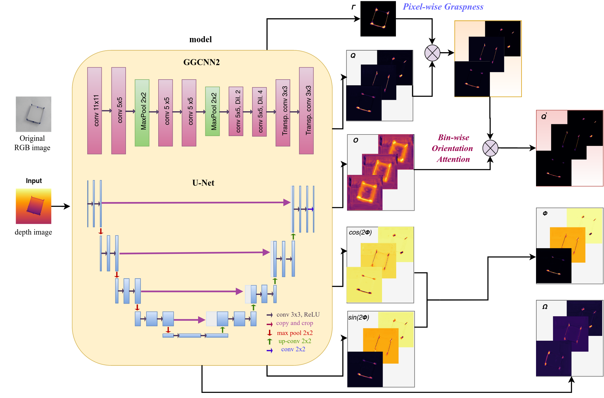

# ORANGE

Code for our paper ''Orientation Attentive Robotic Grasp Synthesis with Augmented Grasp Map Representation'', submitted to ICRA21. For our robotic experiment see https://github.com/gchal/tiago_grasp_plan

 **Abstract:** 
Inherent morphological characteristics in objects may offer a wide range of plausible grasping orientations that obfuscates the visual learning of robotic grasping. Existing grasp generation approaches are cursed to construct discontinuous grasp maps by aggregating annotations for drastically different orientations per grasping point. Moreover, current methods generate grasp candidates across a single direction in the robot's viewpoint, ignoring its feasibility constraints.
In this paper, we propose a novel augmented grasp map representation, suitable for pixel-wise synthesis, that locally disentangles grasping orientations by partitioning the angle space into multiple bins. Furthermore, we introduce the ORientation AtteNtive Grasp synthEsis (ORANGE) framework, that jointly addresses classification into orientation bins and angle-value regression. The bin-wise orientation maps further serve as an attention mechanism for areas with higher \textit{graspability}, i.e. probability of being an actual grasp point. We report new state-of-the-art 94.71\% performance on Jacquard, with a simple U-Net using only depth images, outperforming even multi-modal approaches. Subsequent qualitative results with a real bi-manual robot validate ORANGE's effectiveness in generating grasps for multiple orientations, hence allowing planning grasps that are feasible. Code is available at \url{https://github.com/nickgkan/orange}.

 


## Requirements
Tested with Python 3.5, 3.6, 3.7.
Tested Pytorch versions: >=1.0.1
See requirements.txt!
```
pip -r install requirements.txt
```

## Setup
1. Clone the repository
```
git clone https://github.com/nickgkan/orange.git
cd orange
```
2. Download Jacquard/Cornell datasets.
3. Edit DATA_FOLDER in config.py, providing the path where your dataset is stored.
By default, the code expects a folder 'jacquard' or 'cornell' inside DATA_FOLDER (config.py).
4. Transform annotations and create project folders.
```
python prepare_data.py DATASET
```
where DATASET can be either 'jacquard' or 'cornell'


## Train/test a model
```
python main.py --dataset=DATASET --model=MODEL
```
See main.py for other input arguments.
Also see config.py for choices on dataset and task arguments.
To train/test our best model:
```
python main.py --dataset=jacquard --model=unet --use_bin_loss --use_bin_attention_loss --use_graspness_loss
```

## For further questions
Open an issue!
